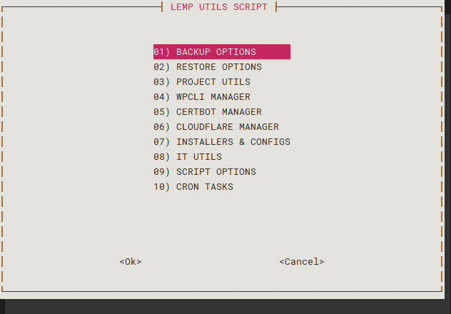

# LEMP Ubuntu Utils Scripts

"LEMP Ubuntu Utils Scripts" is a **BASH** script which can be used to quickly install a LEMP Stack on Ubuntu 18.04 and 20.04 servers, automate backups (files and databases), restore backups, install WordPress projects, and other useful tasks.



## Motivation

* Standarize LEMP stack configuration.
* Reduce time and errors on IT tasks.
* Backup automatization with email report.

## Main Features

* LEMP automated installer (Nginx, MySQL/MariaDB, PHP).
* Files and database backups (MySQL or MariaDB).
* Upload backups to Dropbox (API v2).
* Restore backups from Dropbox or URL.
* WordPress automated installer.
* WP-CLI actions helper.
* Let's Encrypt actions helper.
* Monit installer and configuration helper.
* Netdata installer and configuration helper.
* Certbot installer and configuration helper.
* Cloudflare support (via API).
* PHP-FPM optimization tool (beta).
* Image optimization tools.
* Security Tools with malware scanners (beta).
* IP/Domain blacklist checker.
* Benchmark tool.
* Step-by-step configuration wizard.
* And more ...

## TODO List
[TODO List](./TODO.md)

## Supports

Works on Ubuntu 18.04 LTS and Ubuntu 20.04 LTS.

## IMPORTANT: Read before install

The script need to be runned by root.

The script is based on this standard:

If you want to create a new web project for mydomain.com it will create:
* A database with name 'MYDOMAIN_STAGE' (the script will ask you the project stage). Ex: mydomain_prod
* A database user with name 'MYDOMAIN_user'. Ex: mydomain_user
* A directory for the project files named 'mydomain.com'.
* A nginx configuration for 'mydomain.com'.

So, the restore script only works if this nomenclature is respected.

## Installation

If git is not installed:

```
sudo apt-get update && sudo apt-get install git -y
```

Cloning repo:

```
git clone https://gitlab.com/broobe/lemp-utils-script
```

Change directories to the new ~/lemp-utils-script directory:

```
cd ~/lemp-utils-script
```

## Getting started

Give the execution permission to the script:

```bash
 $chmod +x runner.sh
```

Run it:

```bash
 ./runner.sh
```

The first time you run `runner.sh`, you'll be guided through a wizard in order to configure it. This configuration will be stored in `~/.lemp-utils-script`.

## Update script

Run updater.sh

```
./updater.sh
```

## Running as cron job
This script relies on a different configuration file for each system user. The default configuration file location is `root/.broobe-utils-script`.
This means that if you setup the script with your user and then you try to run a cron job as root, it won't work.

* To setup the script to run as a cron job please use the option "CRON TASKS"

## Third Party Utils

LEMP Utils Script uses some third-party tools:

### Dropbox Uploader

Dropbox Uploader is a BASH script which can be used to upload, download, list or delete files from Dropbox, an online file sharing, synchronization and backup service.

### Google PageSpeed Insights API Tools

gitool.sh shell script to query Google PageSpeed Insights v4 & v5 API for site & origin metrics for FCP & DCL with additional support for GTMetrix & WebpageTest.org API tests

### Blacklist Checker

Blacklist check UNIX/Linux utility.

### Nench

VPS benchmark script — based on the popular bench.sh, plus CPU and ioping tests, and dual-stack IPv4 and v6 speedtests by default

## Contributing
Please read CONTRIBUTING.md for details on our code of conduct, and the process for submitting pull requests to us.

## Code: Bash Best Practices

* https://bertvv.github.io/cheat-sheets/Bash.html
* https://github.com/anordal/shellharden/blob/master/how_to_do_things_safely_in_bash.md

## Authors
* **Leandro Padula** - *Initial work* - [BROOBE](https://www.broobe.com)

## License
This project is licensed under the MIT License - see the [LICENSE](./LICENSE) file for details